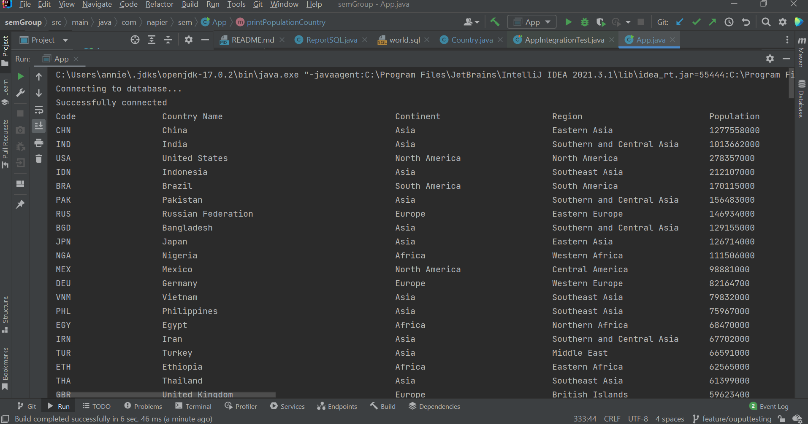
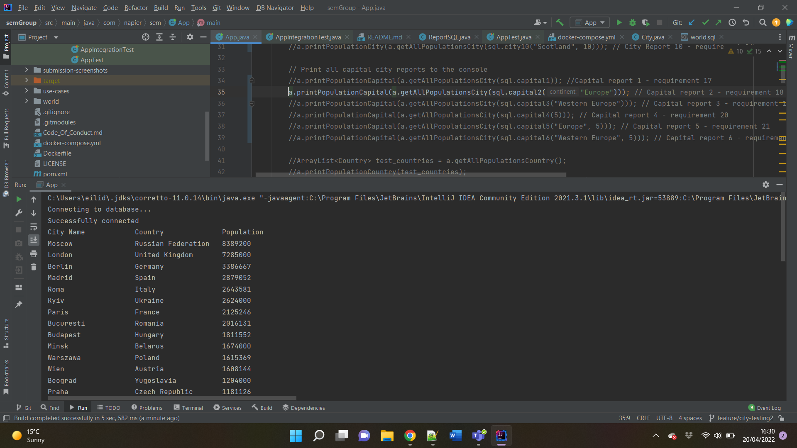
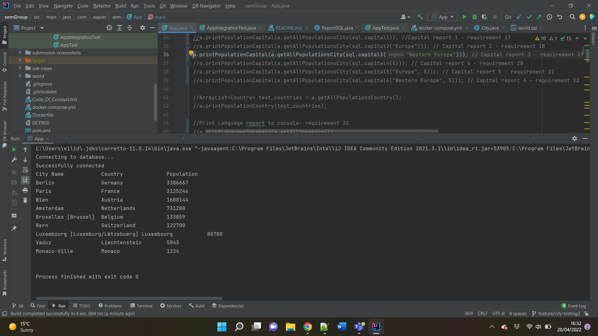

# Software Engineering Methods
### A Java application to create population reports for the World Health Organisation
### Group B Contributors: Eilidh Steel, Annie Nightingale, Kayleigh Finnigan, Scot Tweddle
###Badges
  
  
  
  
  
  

32 requirements of 32 have been implemented, which is 100%.

| ID | Name                                                                                                                                   | Met | Screenshot                                 |
|----|----------------------------------------------------------------------------------------------------------------------------------------|-----|--------------------------------------------|
| 1  | All the countries in the world organised by largest population to smallest.                                                            | Yes |  |
| 2  | All the countries in a continent organised by largest population to smallest.                                                          | Yes |  |
| 3  | All the countries in a region organised by largest population to smallest.                                                             | Yes |  |
| 4  | The top N populated countries in the world where N is provided by the user.                                                            | Yes |  |
| 5  | The top N populated countries in a continent where N is provided by the user                                                           | Yes |  |
| 6  | The top N populated countries in a region where N is provided by the user.                                                             | Yes |  |
| 7  | All the cities in the world organised by largest population to smallest.                                                               | Yes |      |
| 8  | All the cities in a continent organised by largest population to smallest.                                                             | Yes |      |
| 9  | All the cities in a region organised by largest population to smallest.                                                                | Yes |      |
| 10 | All the cities in a country organised by largest population to smallest.                                                               | Yes |    |
| 11 | All the cities in a district organised by largest population to smallest.                                                              | Yes |    |
| 12 | The top N populated cities in the world where N is provided by the user.                                                               | Yes |    |
| 13 | The top N populated cities in a continent where N is provided by the user.                                                             | Yes |    |
| 14 | The top N populated cities in a region where N is provided by the user.                                                                | Yes |    |
| 15 | The top N populated cities in a country where N is provided by the user.                                                               | Yes |    |
| 16 | The top N populated cities in a district where N is provided by the user.                                                              | Yes |    |
| 17 | All the capital cities in the world organised by largest population to smallest.                                                       | Yes |    |
| 18 | All the capital cities in a continent organised by largest population to smallest.                                                     | Yes |    |
| 19 | All the capital cities in a region organised by largest to smallest.                                                                   | Yes |    |
| 20 | The top N populated capital cities in the world where N is provided by the user.                                                       | Yes |    |
| 21 | The top N populated capital cities in a continent where N is provided by the user.                                                     | Yes |    |
| 22 | The top N populated capital cities in a region where N is provided by the user.                                                        | Yes |    |
| 23 | The population of people, people living in cities, and people not living in cities in each continent.                                  | Yes |    |
| 24 | The population of people, people living in cities, and people not living in cities in each region.                                     | Yes |    |
| 25 | The population of people, people living in cities, and people not living in cities in each country.                                    | Yes |    |
| 26 | The population of the world.                                                                                                           | Yes |    |
| 27 | The population of a continent.                                                                                                         | Yes |    |
| 28 | The population of a region.                                                                                                            | Yes |    |
| 29 | The population of a country.                                                                                                           | Yes |    |
| 30 | The population of a district.                                                                                                          | Yes |    |
| 31 | The population of a city.                                                                                                              | Yes |    |
| 32 | The number of people who speak the listed languages from greatest number to smallest, including the percentage of the world population | Yes |    |